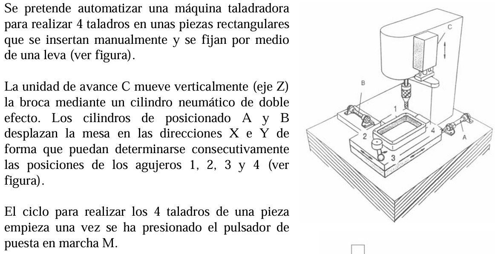
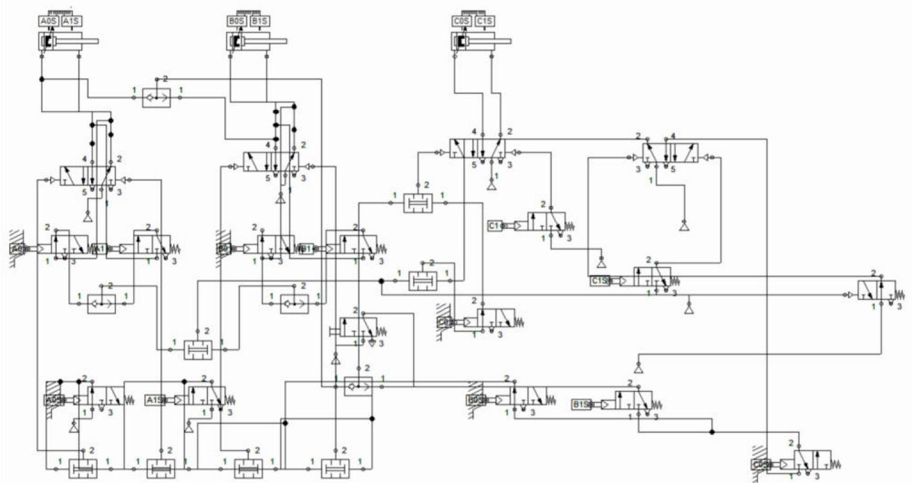
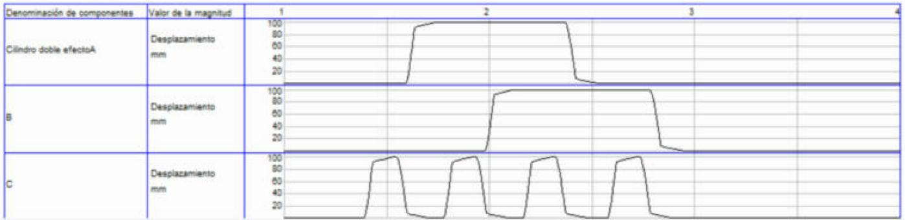

# Taladradora neumática de 4 agujeros (FluidSIM)

Automatización neumática de una taladradora que realiza 4 taladros en piezas rectangulares, diseñada y simulada en **FluidSIM Neumática 4.5**.

**Autor:** David Zuluaga Henao · **Asignatura:** Actuadores y sensores

## Enunciado



Las piezas se insertan manualmente y se fijan con una leva. La unidad de avance **C** (cilindro de doble efecto) mueve la broca en el eje Z. Los cilindros **A** y **B** desplazan la mesa en X e Y para alcanzar las posiciones de los agujeros 1, 2, 3 y 4. El ciclo empieza al pulsar **M**.

**Secuencia:**

```
C+ C- A+ C+ C- B+ C+ C- A- C+ C- B-
```

agujero 1 → A+ → agujero 2 → B+ → agujero 3 → A- → agujero 4 → B- (vuelve a origen)

## Solución

La mesa (A, B) recorre un código Gray de 4 posiciones y entre cada movimiento se ejecuta un taladrado C+ C-. Una memoria **D** (válvula 5/2 biestable) indica que ya se taladró en la posición actual. SA y SB son las salidas de las válvulas de mando VA y VB.

| Señal | Ecuación lógica | Implementación |
|---|---|---|
| Posición alcanzada (P) | (a1·SA + a0·SA') · (b1·SB + b0·SB') | Finales a0, a1, b0, b1 alimentados desde las líneas de los cilindros + 2 válvulas O + 1 válvula Y |
| C+ | P · D' · c0 · (M + SA + SB) | Y2, final c0, Y3, O3, O4, pulsador M |
| C- y set D | c1 | Final c1 (y c1s para la memoria) |
| Reset D | NOT P | Válvula 3/2 NA pilotada por P |
| X (avanzar mesa) | D · c0 | Final c0s alimentado desde D |
| A+ / B+ / A- / B- | X·b0·a0 / X·b0·a1 / X·b1·a1 / X·b1·a0 | Finales b0s, b1s, a0s, a1s + 4 válvulas Y |

Al terminar el ciclo (B- vuelve a la posición 1), la condición (M + SA + SB) es falsa y el sistema se detiene hasta un nuevo pulso de M.

### Componentes

- 3 cilindros de doble efecto (A, B, C)
- 4 válvulas 5/2 biestables neumáticas (VA, VB, VC y memoria D)
- 12 finales de carrera 3/2 NC con rodillo (a0, a1, b0, b1, c0, c1 y sus duplicados con sufijo *s*, porque FluidSIM no permite repetir marcas)
- 7 válvulas de simultaneidad (Y) y 4 válvulas selectoras (O)
- 1 válvula 3/2 NA pilotada (negación)
- 1 pulsador 3/2 NC (M) y fuentes de aire

## Esquema en FluidSIM



## Simulación

Diagrama de estado (desplazamiento en mm frente a tiempo en s) de los cilindros A, B y C tras un único pulso de M:



| Paso | Posición mesa (A, B) | Movimiento |
|---|---|---|
| 1-2 | (0, 0) – agujero 1 | C+ C- |
| 3 | — | A+ |
| 4-5 | (1, 0) – agujero 2 | C+ C- |
| 6 | — | B+ |
| 7-8 | (1, 1) – agujero 3 | C+ C- |
| 9 | — | A- |
| 10-11 | (0, 1) – agujero 4 | C+ C- |
| 12 | — | B- (vuelve a origen y se detiene) |

## Archivos

| Archivo | Descripción |
|---|---|
| [`fluidsim/Taladradora_4agujeros.ct`](fluidsim/Taladradora_4agujeros.ct) | Circuito para FluidSIM Neumática 4.5 |
| [`docs/Informe_Taladradora.pdf`](docs/Informe_Taladradora.pdf) | Informe completo |

Para simularlo, abre el `.ct` en FluidSIM Neumática, pulsa **Iniciar** (F9) y haz clic en el pulsador M.
